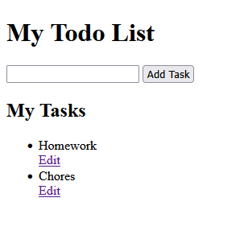
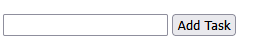
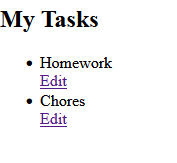
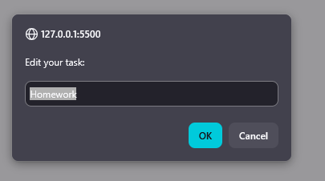
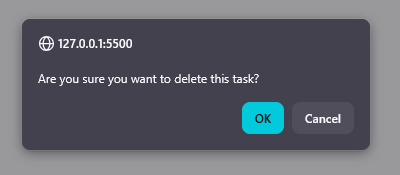

# A2SV Todo List

A simple Todo List web app that demonstrates basic add, edit and remove task functionalites.

## What it does

- Add a task
  
- Display tasks
  
- Edit tasks
  
- Remove a task
  

## How to run

1. Open "index.html" in a browser.
2. Enter task name on the input field and click the "Add Task" button.
3. Click the "Edit" anchor tag below each list item to edit the task.
4. Click any task in the list to remove it.
